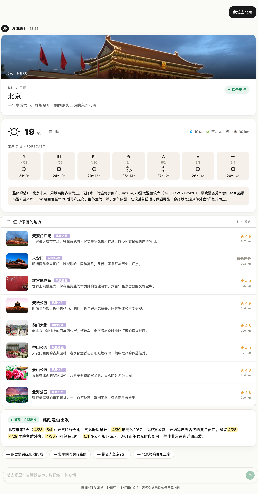
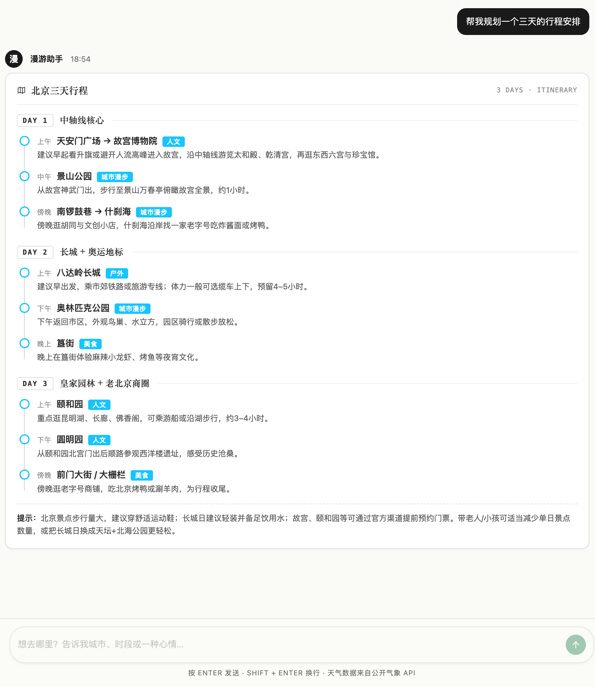
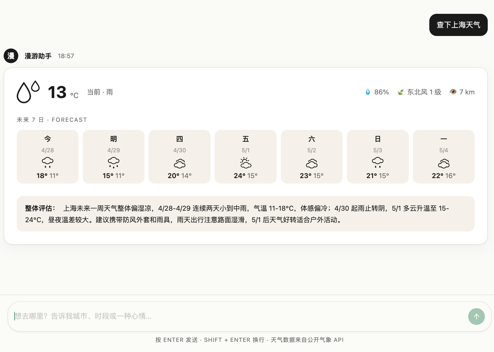
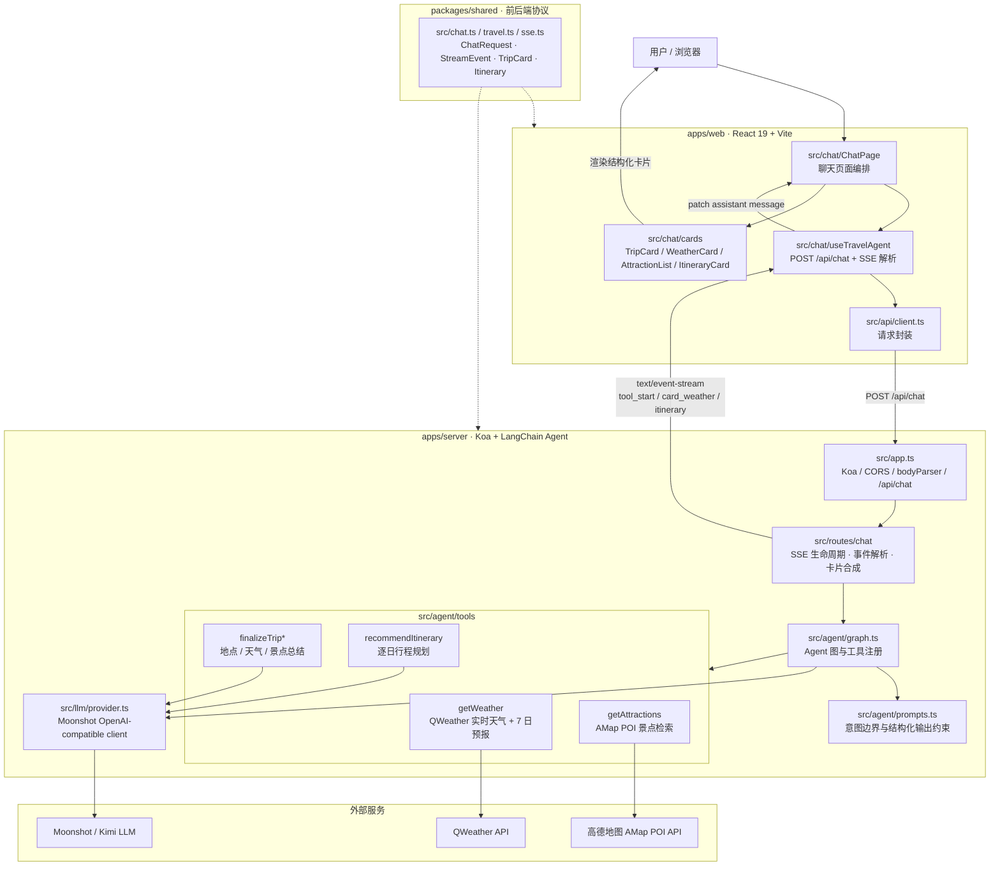

# Travel Suggest Robot / 漫游助手

一个面向中文用户的旅行规划 AI Agent 应用。用户输入目的地或行程诉求后，系统会结合大模型、实时天气和地图 POI 数据，输出可直接渲染的结构化旅行建议，而不是只返回一段普通聊天文本。

核心能力：

- **目的地判断**：输入“我想去杭州”，生成包含地点 Hero、实时天气、未来 7 日预报、热门景点和出行建议的 TripCard。
- **行程编排**：输入“杭州三天两晚怎么规划”，生成按 Day 拆分的 Itinerary 行程卡。
- **上下文追问**：对旅行相关追问保持历史上下文，对非旅行请求做边界控制，避免 Agent 偏离业务范围。

## 项目简介

这个项目模拟的是一个“出发前旅行决策助手”：用户不需要分别打开天气 App、地图 App 和攻略网站，只要说出想去哪里，系统就能聚合实时天气、景点 POI 和大模型总结，帮助用户快速判断“现在适不适合去、去了看什么、行程怎么安排”。

项目重点不是简单接一个聊天接口，而是把 AI 输出落到前端可消费的结构化协议里。后端用 Agent 编排工具调用，前端通过 SSE 渐进式接收事件，并把天气、景点、建议和行程渲染成稳定的卡片化体验。

## 在线体验 / 效果预览

### 目的地推荐卡

输入 `我想去北京` 后，系统会聚合目的地 Hero、未来 7 日天气、热门景点和出行建议，渐进式生成 TripCard。



### 三天行程卡

输入 `帮我规划一个三天的行程安排` 后，系统会按 Day 拆分主题、时间段活动、标签和出行提示。



### 天气查询卡

输入 `查下上海天气` 后，系统会直接展示当前天气、未来 7 日预报和整体出行评估。



本地启动后可以用这些对话样例体验核心路径：

| 输入 | 预期体验 |
| --- | --- |
| `我想去杭州` | 触发 TripCard：先展示天气和景点裸数据，再逐步补齐地点介绍、天气总结、出行建议和追问 chips。 |
| `杭州三天两晚怎么规划？` | 触发 ItineraryCard：按 Day 1 / Day 2 / Day 3 展示每天主题、时间轴活动和提示。 |
| `带老人适合吗？` | 基于上一轮目的地上下文自然语言回答，不重复查询同一个城市的工具数据。 |
| `帮我写一段 JavaScript` | 识别为非旅行请求，按固定边界文案拒答。 |

## 核心业务流程

```text
用户输入目的地
  -> Agent 判断为 TripCard 意图
  -> 并行查询 QWeather 天气 + 高德 POI 景点
  -> 内部 finalize 工具生成地点、天气总结、景点描述和出行建议
  -> Server 通过 SSE 分段下发结构化事件
  -> Web 渐进式渲染 TripCard
```

```text
用户输入“几天怎么玩”
  -> Agent 判断为行程编排意图
  -> recommendItinerary 内部工具生成结构化 Itinerary
  -> Server 下发 itinerary SSE 事件
  -> Web 渲染逐日时间轴行程卡
```

对于美食、雨天玩法、人群适配、历史卡片追问等不需要重新查实时数据的问题，Agent 会走纯文本回答，避免每轮都重复调用外部 API。

## 技术架构



仓库采用 pnpm workspace 组织：

- `apps/web`：React 19 + Vite 6 前端，负责聊天界面、SSE 消费、TripCard / ItineraryCard 渐进渲染。
- `apps/server`：Node 24 + Koa + LangChain 后端，负责请求校验、Agent 调用、工具编排和 SSE 输出。
- `packages/shared`：前后端共享 TypeScript 类型，约束 `ChatRequest`、`StreamEvent`、`TripCard`、`Itinerary` 等协议。

## 技术细节

### Agent 工具编排

后端通过 LangChain `createAgent` 注册业务工具，并在系统 Prompt 中显式约束三类路径：

- TripCard：适合“我想去 X / X 适不适合去 / 推荐 X 景点”等单一目的地实时数据诉求。
- ItineraryCard：适合“X 三天两晚怎么玩 / 五一去 X 玩 4 天”等行程编排诉求。
- 纯文本：适合旅行常识、历史追问、多城市开放咨询，以及所有非结构化回答场景。

这样做的目标是让模型不只是“会聊天”，而是能稳定进入不同业务分支，并输出前端可以直接渲染的数据结构。

### SSE 渐进式渲染

TripCard 不是等所有内容生成完再一次性返回。服务端会把 LangChain `streamEvents` 转成前端事件：

- `tool_start` / `tool_end`：公开展示 `getWeather`、`getAttractions` 的执行状态和裸数据。
- `card_destination`：补齐地点 Hero、行政区链路、出行评估 badge。
- `card_weather`：补齐基于真实天气数据的整体 summary。
- `card_attractions_summary`：补齐景点描述、出行建议和后续追问 chips。
- `itinerary`：行程编排分支下发完整 Itinerary 卡片数据。

前端收到事件后就地 patch 当前 assistant 消息，让用户先看到已完成的数据，再逐步看到 narrative 补齐，降低等待感。

### 结构化输出治理

内部工具 `finalizeTripDestination`、`finalizeTripWeather`、`finalizeTripAttractionsSummary`、`recommendItinerary` 只负责让模型按 Zod schema 填结构化字段，并返回 JSON 字符串。这样可以规避 Moonshot / OpenAI 兼容协议下对象返回被拆成 content block 后导致的 `unknown content type` 问题。

后端再把模型 narrative 与外部 API 裸数据合并：例如城市名优先来自 QWeather，Hero 图片来自高德 POI 第一张可用图片，景点描述按索引补齐。事实字段尽量由可信工具结果派生，减少模型编造。

### 多轮上下文防重复调用

结构化卡片场景里，assistant 的最终文本通常为空，因为真正展示内容在卡片数据里。为了避免下一轮模型看到“连续两条 user 消息”后误以为上一轮没处理完，前端会把已完成的卡片合成为历史摘要，例如：

```text
[已为「杭州」生成完整行程卡（含天气、8 条景点、出行建议）。请勿为该地名重复调用工具。]
```

后端同时做单轮工具去重：同一轮里 `getWeather` / `getAttractions` 各最多对外下发一次，被去重的 tool result 也不会污染缓存。这样即使模型在边界场景重复发起工具调用，最终卡片也不会出现“北京天气 + 上海景点”这类数据错位。

### 真实 API 接入与工程兜底

- QWeather 使用 Ed25519 私钥本地签发 JWT，短 TTL 缓存并提前刷新。
- 高德 POI 使用 `v5/place/text`，优先 region 精确检索，空结果时降级为“地名 + 景点”关键词兜底。
- 景点距离通过 QWeather 城市中心坐标和 POI 坐标做 haversine 计算。
- 环境变量用 Zod 启动时校验，缺失配置直接失败，避免应用带病运行。
- 输入安全中间件会清洗控制字符，并限制单条消息长度和历史消息数量。
- nginx 对 `/api` 反向代理时关闭 buffering，保证 SSE 流式事件不会被攒包后才下发。

## 关键数据流

### TripCard 数据流

```text
User message
  -> POST /api/chat
  -> historyToAgentMessages
  -> LangChain Agent
  -> getWeather + getAttractions
  -> finalizeTripDestination
  -> finalizeTripWeather
  -> finalizeTripAttractionsSummary
  -> card_destination / card_weather / card_attractions_summary
  -> TripCardView
```

服务端在 `card_attractions_summary` 后会主动短路后续 LLM 续写，因为此时结构化卡片已经完整，继续等待模型输出“已生成行程卡”之类文本只会浪费时间和 token。

### Itinerary 数据流

```text
User message
  -> Agent 识别行程规划意图
  -> recommendItinerary
  -> itinerary SSE event
  -> ItineraryCard
```

行程卡不查询实时天气或票价，避免模型编造动态数据；时间字段优先使用“上午 / 下午 / 傍晚 / 晚上”这类宽口径表达。

## 工程化与部署

- **Monorepo**：pnpm workspace 管理 `web`、`server`、`shared` 三个包。
- **TypeScript Project References**：`@travel/shared` 先构建类型声明，供前后端复用。
- **ESM + Node 24**：服务端以 ESM 方式运行，开发环境使用 `node --watch`。
- **Docker 多阶段构建**：server 和 web 分别构建，只把生产需要的 dist 和依赖放入运行镜像。
- **nginx 静态托管与反代**：web 容器托管 Vite build 产物，`/api` 代理到 server 容器，并保留 SSE 流式能力。

## 本地启动

### 环境要求

- Node 24（建议使用仓库内 `.nvmrc`，执行 `nvm use`）
- pnpm 10

### 安装依赖

```bash
pnpm install
pnpm --filter @travel/shared build
```

`@travel/shared` 需要先构建一次，让 server 和 web 都能读取共享类型声明。

### 配置环境变量

复制 `.env.example` 为 `.env`，并填写：

```bash
cp .env.example .env
```

关键字段说明：

| 变量 | 说明 |
| --- | --- |
| `MOONSHOT_API_KEY` | Moonshot / Kimi API Key。 |
| `MOONSHOT_MODEL` | 默认 `kimi-k2.6`，可按账号可用模型调整。 |
| `QWEATHER_API_HOST` | QWeather 项目绑定的 API Host。 |
| `QWEATHER_PROJECT_ID` | QWeather 项目 ID，用作 JWT `sub`。 |
| `QWEATHER_KEY_ID` | QWeather 凭据 ID，用作 JWT header `kid`。 |
| `QWEATHER_PRIVATE_KEY_PATH` | Ed25519 PKCS8 私钥路径，默认指向 `secrets/qweather-ed25519-private.pem`。 |
| `AMAP_KEY` | 高德地图 Web 服务 API Key。 |
| `CORS_ORIGIN` | 开发环境默认 `http://localhost:5173`。 |

### 开发模式

可以一条命令同时启动前后端：

```bash
pnpm dev
```

也可以分终端启动：

```bash
pnpm dev:server
pnpm dev:web
```

默认地址：

- Web: http://localhost:5173
- Server: http://localhost:3001
- Vite 会把 `/api` 代理到 Koa server。

### 常用检查

```bash
pnpm typecheck
pnpm build
pnpm --filter @travel/server ping:llm
pnpm --filter @travel/server ping:weather
```

## Docker 部署

```bash
docker compose up --build
```

启动后访问：

- Web: http://localhost:8080
- Server: http://localhost:3001

`nginx.conf` 中 `/api/` 会代理到 server 容器，并通过 `proxy_buffering off`、较长 read timeout 等配置保证 SSE streaming 正常工作。

## 可继续优化

- 补充自动化测试，覆盖 SSE frame 解析、工具去重、历史摘要、多轮追问等关键逻辑。
- 扩展更多旅行工具，例如交通时间估算、预算拆分、住宿区域建议、路线收藏。
- 增加可观测性面板，统计工具耗时、外部 API 错误率、短路节省的 token 和响应时间。
